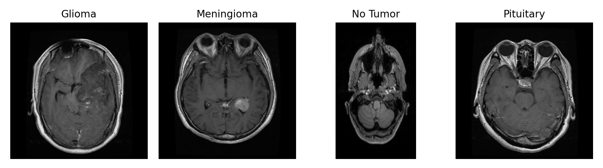
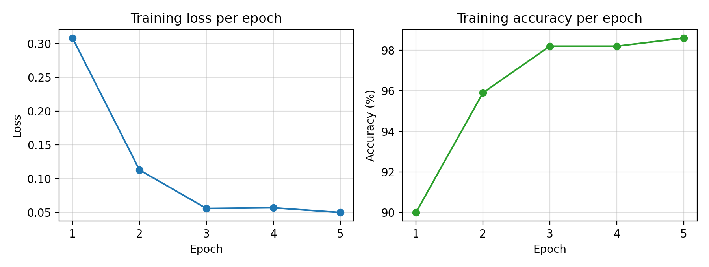
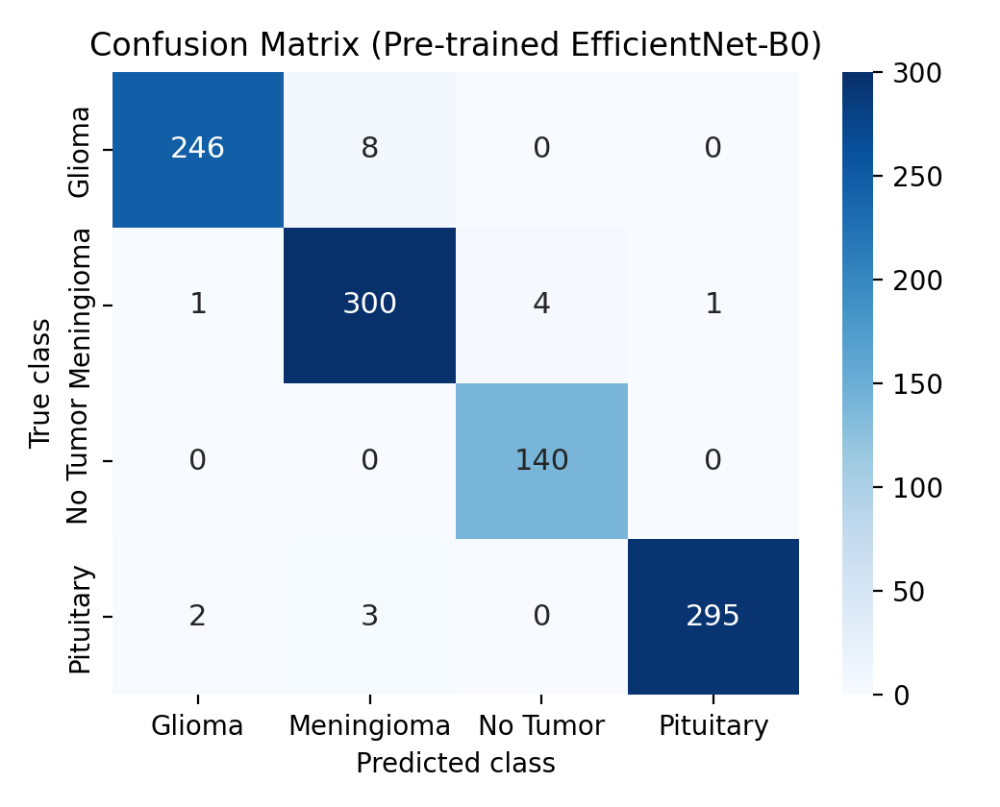

# 🧠 Brain Tumor MRI Classifier

Diagnosing a brain tumor from an MRI scan is still mostly a manual job for radiologists — it is slow, and two doctors can read the same scan differently. So I built a deep learning classifier that sorts brain MRI scans into four categories: **glioma**, **meningioma**, **pituitary tumor**, or **no tumor** at all. The core of it is a fine-tuned **EfficientNet-B0**, and it reaches **98.10% test accuracy** with a macro F1-score of 0.98.

This repo holds the code, the trained models, and a small Streamlit app that runs the classifier on any scan you upload.

## What it does

I built the app so the model is not stuck inside a script. You upload an MRI image, it runs the same preprocessing used during training, and it shows the predicted class along with the probability for each of the four classes. Next to that it displays a **Grad-CAM** overlay — a heatmap of which pixels actually drove the prediction. Getting the right label does not mean the model is looking at the right place, so this was my way of checking. On the scans I tried, the highlighted region lined up with the tumor itself, not some unrelated part of the image.

The four classes look like this:



<!-- Optional: save a screenshot of the app and drop it here as assets/demo.png, then delete these comment markers
 -->

## Results

| Model | Test accuracy |
|---|---|
| EfficientNet-B0, pre-trained (ImageNet) | **98.10%** |
| EfficientNet-B0, from scratch | 79.60% |

What surprised me is that, with the same architecture, the same five epochs, and everything else held constant, the gap is still more than 18 points. A possible explanation is that the low-level features learned from ImageNet — edges, textures, simple shapes — transfer well to MRI images too. I did not expect this to work so well, and since only 5000 training images were available, that head start probably made a big difference.

| Training curves | Confusion matrix |
|---|---|
|  |  |

Mistakes are rare, and the few that happen are between tumor types that genuinely look similar. The *no tumor* class comes out classified perfectly, which matters in practice — missing a healthy scan and flagging it as something dangerous would be a costly false alarm.

## Try it yourself

```bash
pip install -r requirements.txt
streamlit run app.py        # opens the web app
```

The other scripts: `metrici.py` trains the pre-trained model and produces the metrics and plots, `train.py` trains the from-scratch baseline, `gradcam.py` runs Grad-CAM on one test image, and `explore_data.py` gives a quick look at the dataset. Run everything from the project root.

## Dataset

I used the **BRISC 2025** dataset — 6000 T1-weighted MRI images, 5000 for training and 1000 for testing, roughly balanced across the four classes and captured from axial, coronal, and sagittal planes. It is not included here because of its size; download it from Kaggle and drop it in so the paths look like `brisc2025/classification_task/train/<class>/`.

## How the model is set up

EfficientNet-B0 backbone, with its original 1000-class head swapped for a new linear layer with four outputs. Adam optimizer at a learning rate of 0.001, cross-entropy loss, batch size 32, five epochs. Each image is resized to 224×224, converted to a tensor, and normalized with the ImageNet mean and standard deviation so the inputs match what the pre-trained backbone expects.

---

*Tănase Mara-Ruxandra — Faculty of Mathematics and Computer Science, University of Bucharest.*
